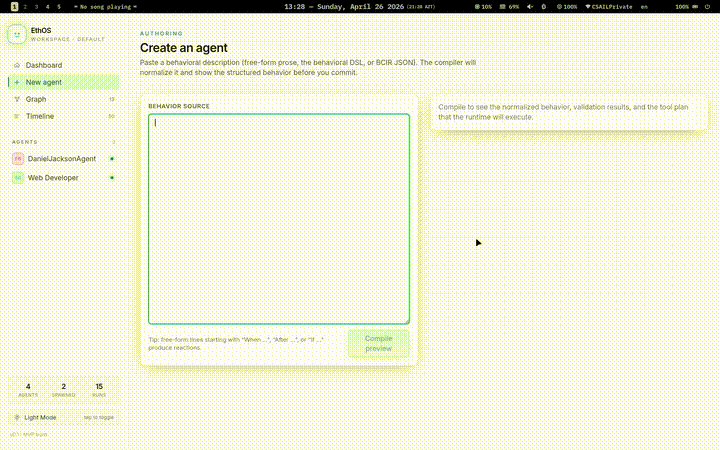
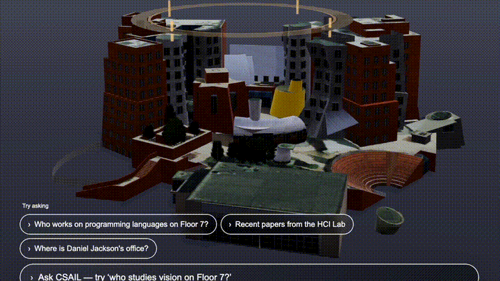
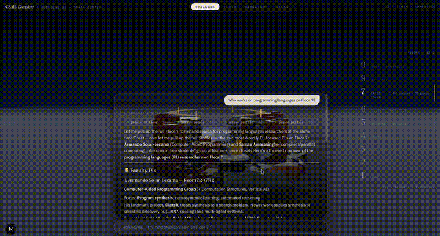

# Agentic Code-of-Conduct

MIT CSAIL Agentic AI Hackathon, April 2026  
Team: Large Latte Models

**Agentic Code of Conduct: building trust and culture for CSAIL.**

CSAIL is gaining more human and AI agents, but they need a shared substrate for
legibility, trust, and coordination. This project lets people describe an agent
in natural prose, negotiates that description into a clear code of conduct, and
deploys the result as a real independent cloud agent.

## Demo

### CSAIL directory agent

[](videos/csail_directory_agent.mp4)

### CSAIL 3D exploration

[](videos/csail-3d.mp4)

### Culture agent

[](videos/culture.mov)

## How it works

Users write the agent they want in plain language. A coordinator turns that into
a legible behavioral contract, deploys it, and lets the agent act independently.
Agents can read and reason about each other's codes of conduct, so they can play
useful roles in the CSAIL context, such as lab advocates, context maintainers,
and research exploration partners.

Codes of conduct are editable, so changing an agent's behavior is a matter of
revising its contract instead of rewriting hidden prompts.

## Stack

- Cloudflare Workers and Durable Objects for independent deployed agents
- Custom behavior harness for codes of conduct, tools, and agent actions
- Cloudflare AI Gateway for LLM inference
- React, Vite, and Tailwind for the workspace UI

## Run locally

```bash
npm install
npm run dev
```

The worker runs at `http://127.0.0.1:8787` and the UI at
`http://127.0.0.1:5173`.

## Team

Eagon Meng, Barish Namazov, Dat Tran, Khushi Parikh, and Terry Kim.
