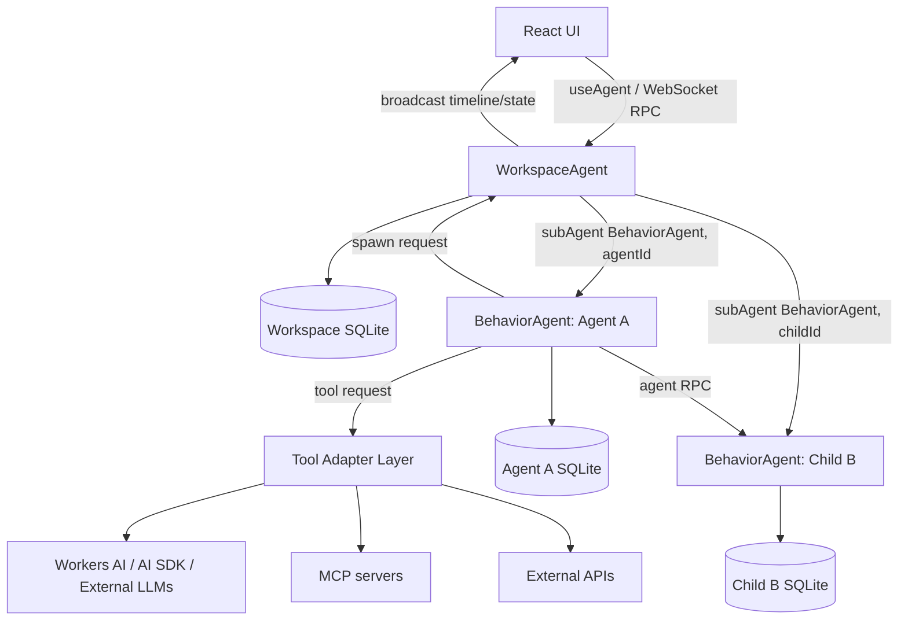
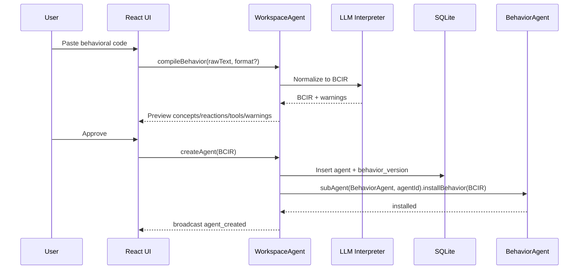
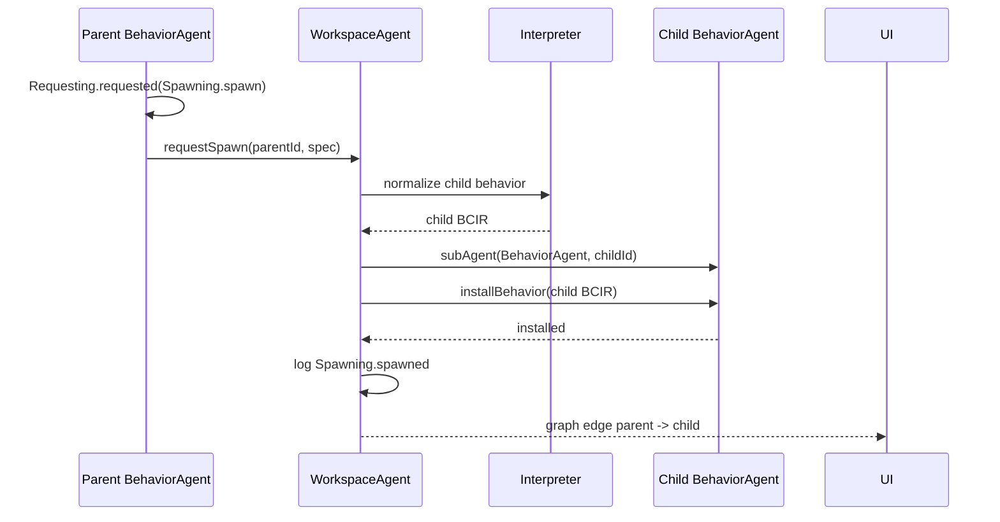

# MVP Plan: Behavioral-Code Agent Ecosystem on Cloudflare Agents SDK

**Date:** 2026-04-25
**Goal:** Build a working MVP of a product UI where users can create agents from existing behavioral code, run them with real-time streaming, and inspect the agents they spawn and the tools they call.

---

## 1. Executive summary

Yes: Cloudflare's Agents SDK is a strong fit for the MVP.

The SDK already gives us the main substrate we need:

- Stateful Agent instances backed by Durable Objects.
- Embedded SQLite per Agent instance.
- WebSocket client connections.
- Real-time state synchronization.
- Streaming responses.
- Client-side React hooks.
- RPC-style callable methods.
- Sub-agents with isolated storage and typed RPC.
- Observability hooks for RPC, state, message, tool, schedule, workflow, MCP, and email events.
- Workers AI / AI SDK integration for LLM calls.

The main architectural caveat is this:

> Generated agents should not be implemented as dynamically generated Worker classes. They should be implemented as new instances of one or more generic exported Agent classes whose behavior is loaded from behavioral code stored in SQLite.

Cloudflare Workers need exported classes at deploy time. The behavioral-code platform, however, wants agents to be generated at runtime. The bridge is to export a generic `BehaviorAgent` class and instantiate it many times with different behavioral-code versions, action logs, tools, and parent-child relationships.

The MVP should therefore be a **behavioral runtime product** built on top of the Agents SDK, not a code-generation system that redeploys Workers for every new agent.

**Clarification on spawned agents:** in this plan, a spawned behavioral agent is not a prompt fragment, not an in-memory helper object, and not the informal “subagent” pattern sometimes used in agent frameworks. It is a named Cloudflare Agents SDK sub-agent: a child Agent/Durable Object facet created with `this.subAgent(BehaviorAgent, childId)`, with its own Agent identity, lifecycle, state, and isolated SQLite database. It does not require its own Durable Object namespace binding or migration, because Cloudflare discovers exported child classes from the Worker bundle and provisions child storage as a facet of the parent Durable Object.

---

## 2. Product scope for the MVP

The MVP is not the full “city of agents.” It should prove the loop:

1. A user imports or writes behavioral code.
2. The system normalizes it into an executable internal representation.
3. The system creates an agent from that behavior.
4. The user chats with or triggers the agent.
5. The agent streams progress and output in real time.
6. The agent may call tools.
7. The agent may spawn sub-agents.
8. The UI shows the live action timeline, tool calls, sub-agent tree, and provenance.
9. The user can inspect and revise the agent's behavioral code.

### MVP product screens

1. **Workspace dashboard**
   - List of agents.
   - Recent runs.
   - Spawn graph overview.
   - Failed tool calls / pending approvals.

2. **Create agent**
   - Paste behavioral code in any format.
   - Optional name, description, owner.
   - Button: “Compile / Normalize.”
   - Shows parsed concepts, reactions, and warnings.
   - User approves creation.

3. **Agent detail**
   - Current behavioral code.
   - Normalized internal representation.
   - Version history.
   - Spawned children.
   - Tools available.
   - Action-log inspector.

4. **Live run console**
   - Chat-style streaming output.
   - Event timeline.
   - Tool-call cards.
   - Spawned-agent cards.
   - Final result.
   - Provenance chain.

5. **Graph view**
   - Nodes: agents, tools, artifacts, actions.
   - Edges: spawned, requested, fulfilled, attested, superseded.
   - Clicking a node opens its log and behavioral-code source.

---

## 3. Source-of-truth rule

The central rule from the behavioral-code document must survive the implementation:

> Behavioral code is the source; the deployed agent is its projection.

For the MVP this means:

- Every created agent has a stored behavioral-code record.
- Every behavior version is append-only.
- Every agent action is written to an action log.
- Every action is wrapped with actor/provenance metadata.
- Runtime prompts are generated from behavioral code and the current event context.
- The UI can always show the behavior version an agent was running when it acted.

This is more important than building a perfect DSL compiler on day one.

---

## 4. Cloudflare Agents SDK mapping

| Behavioral-code requirement | Agents SDK feature | MVP approach |
|---|---|---|
| Stateful agents | `Agent` / `AIChatAgent` Durable Object classes | Use exported generic `WorkspaceAgent` and `BehaviorAgent` classes |
| Persistent action log | Embedded SQLite via `this.sql` | Store all actions, tool calls, behavior versions, and graph edges in SQL |
| Real-time UI | WebSockets, `useAgent`, `useAgentChat`, `setState`, `broadcast` | Connect UI to `WorkspaceAgent`; stream live events and dashboard projections |
| Streaming model output | `AIChatAgent`, AI SDK `streamText`, callable streaming | Use `AIChatAgent` for chat-like runs or `@callable({ streaming: true })` for custom run streams |
| Spawned agents | `subAgent()` | Spawn named child `BehaviorAgent` instances as real sub-agents / Durable Object facets with isolated SQLite, not prompt-only helpers |
| Agent-to-agent calls | Durable Object RPC / sub-agent stubs | Parent and child agents communicate via typed RPC, but every interaction is also logged as behavioral actions |
| Tool calls | AI SDK tools, server methods, MCP clients | Wrap tools behind `Tooling.requested` / `Tooling.completed` action records |
| UI RPC | `@callable()` | Expose create/import/run/inspect methods to the browser |
| Observability | diagnostics channels | Mirror SDK events into the product's action timeline where useful |
| Behavior revision | SQLite + append-only versions | Store `behavior_versions`; mark current by pointer, never overwrite |

---

## 5. Recommended high-level architecture



### Main server classes

#### `WorkspaceAgent`

The workspace Durable Object is the product control plane.

Responsibilities:

- Own the UI WebSocket connection.
- Store workspace-level registry data.
- Create agents.
- Normalize behavioral code.
- Maintain the global action timeline.
- Maintain graph projections.
- Relay child-agent events to the UI.
- Provide callable methods for the frontend.
- Optionally run chat if we choose to make it an `AIChatAgent`.

Recommended base class for MVP:

```ts
export class WorkspaceAgent extends Agent<Env, WorkspaceState> {}
```

Use `AIChatAgent` only if the workspace itself needs first-class chat message persistence. Otherwise keep chat/runs custom and streamed through callable methods.

#### `BehaviorAgent`

A generic runtime for user-created and spawned agents.

Responsibilities:

- Store its current behavior version.
- Store local action log if needed.
- Execute behavior in response to observations.
- Call tools through the tool adapter.
- Spawn children through `subAgent(BehaviorAgent, childId)`.
- Emit events back to its parent workspace.

Recommended base class:

```ts
export class BehaviorAgent extends Agent<Env, BehaviorAgentState> {}
```

For chat-heavy agents, we can later introduce:

```ts
export class ChatBehaviorAgent extends AIChatAgent<Env, BehaviorAgentState> {}
```

But for MVP, one generic `BehaviorAgent` with explicit streaming is simpler.

#### Sub-agent identity model

Every spawned behavioral child should be treated as a real agent instance:

- It is created with `this.subAgent(BehaviorAgent, childId)`.
- `childId` is the durable identity of that child within the parent.
- The child has its own `this.state`.
- The child has its own isolated `this.sql` database.
- The child runs `BehaviorAgent.onStart()` on first creation and can expose typed RPC methods to the parent.
- The parent stores an explicit `spawn_edges` row so the product UI can show the parent/child graph.
- The child still runs the generic exported `BehaviorAgent` class; its distinct behavior comes from its installed behavioral-code version.

This is deliberately stronger than a common “subagent definition” abstraction where the child is just a role prompt inside the parent agent's context. In this product, the child is a separately addressable SDK sub-agent with its own storage and provenance.

Cloudflare's sub-agent model does have one important nuance: the child class must be exported from the Worker bundle, and sub-agents do not need separate Durable Object bindings or migrations. If a future feature needs direct browser routing, independent top-level scheduling, or a separate namespace for children, add `BehaviorAgent` as a top-level Durable Object binding as well.

#### `ToolAgent` or tool adapter functions

Do not make every tool a Durable Object on day one. Start with in-process tool adapter functions called by `BehaviorAgent`, but log every request and completion as actions.

Later, tools can be promoted to dedicated Agents or MCP servers.

---

## 6. Why not generate new Worker classes for every agent?

Because the runtime needs agents to be created dynamically from behavior documents. Cloudflare Workers discover exported Agent classes from the Worker bundle. The class must already exist in the deployed code.

Therefore:

- `BehaviorAgent` is the exported class.
- Each created agent is an instance/facet with a distinct name.
- The behavior is data, not code.
- The compiler produces a behavior plan stored in SQLite.
- The generic runtime interprets that plan.

This fits the behavioral-code philosophy: the deployed agent is a projection of behavioral code, not a pile of generated orchestration code.

---

## 7. Data model

Use SQLite as the canonical store. Use `setState()` only for a compact UI projection.

### 7.1 Workspace tables

```sql
CREATE TABLE IF NOT EXISTS agents (
  id TEXT PRIMARY KEY,
  name TEXT NOT NULL,
  kind TEXT NOT NULL,                  -- "top_level" | "spawned" | "tool" | "system"
  parent_agent_id TEXT,
  current_behavior_version_id TEXT,
  status TEXT NOT NULL,                -- "draft" | "active" | "paused" | "archived"
  created_at TEXT NOT NULL,
  updated_at TEXT NOT NULL
);

CREATE TABLE IF NOT EXISTS behavior_versions (
  id TEXT PRIMARY KEY,
  agent_id TEXT NOT NULL,
  version_number INTEGER NOT NULL,
  raw_format TEXT NOT NULL,            -- "behavioral-dsl" | "markdown" | "json" | "yaml" | "unknown"
  raw_text TEXT NOT NULL,
  normalized_json TEXT NOT NULL,
  compiler_warnings_json TEXT NOT NULL,
  supersedes_version_id TEXT,
  created_by TEXT NOT NULL,
  created_at TEXT NOT NULL
);

CREATE TABLE IF NOT EXISTS concepts (
  id TEXT PRIMARY KEY,
  behavior_version_id TEXT NOT NULL,
  name TEXT NOT NULL,
  purpose TEXT NOT NULL,
  principle TEXT,
  state_description TEXT,
  actions_json TEXT NOT NULL
);

CREATE TABLE IF NOT EXISTS reactions (
  id TEXT PRIMARY KEY,
  behavior_version_id TEXT NOT NULL,
  name TEXT NOT NULL,
  prose TEXT NOT NULL,
  formal_text TEXT NOT NULL,
  normalized_json TEXT NOT NULL,
  enabled INTEGER NOT NULL DEFAULT 1
);

CREATE TABLE IF NOT EXISTS action_log (
  id TEXT PRIMARY KEY,
  workspace_id TEXT NOT NULL,
  actor_agent_id TEXT NOT NULL,
  behavior_version_id TEXT,
  action_name TEXT NOT NULL,
  args_json TEXT NOT NULL,
  caused_by_action_id TEXT,
  caused_by_reaction_id TEXT,
  run_id TEXT,
  created_at TEXT NOT NULL
);

CREATE INDEX IF NOT EXISTS idx_action_log_actor_created
ON action_log(actor_agent_id, created_at);

CREATE INDEX IF NOT EXISTS idx_action_log_run_created
ON action_log(run_id, created_at);

CREATE TABLE IF NOT EXISTS tool_calls (
  id TEXT PRIMARY KEY,
  run_id TEXT NOT NULL,
  actor_agent_id TEXT NOT NULL,
  tool_name TEXT NOT NULL,
  request_action_id TEXT NOT NULL,
  status TEXT NOT NULL,                -- "requested" | "running" | "completed" | "failed"
  input_json TEXT NOT NULL,
  output_json TEXT,
  error_text TEXT,
  started_at TEXT,
  completed_at TEXT
);

CREATE TABLE IF NOT EXISTS spawn_edges (
  id TEXT PRIMARY KEY,
  parent_agent_id TEXT NOT NULL,
  child_agent_id TEXT NOT NULL,
  spawn_action_id TEXT NOT NULL,
  run_id TEXT,
  created_at TEXT NOT NULL
);

CREATE TABLE IF NOT EXISTS run_sessions (
  id TEXT PRIMARY KEY,
  root_agent_id TEXT NOT NULL,
  status TEXT NOT NULL,                -- "running" | "completed" | "failed" | "cancelled"
  input_text TEXT,
  started_at TEXT NOT NULL,
  completed_at TEXT
);
```

### 7.2 Behavior agent local tables

Each `BehaviorAgent` should keep its own local copy/cache of current behavior plus local execution state.

```sql
CREATE TABLE IF NOT EXISTS local_behavior (
  id TEXT PRIMARY KEY,
  behavior_version_id TEXT NOT NULL,
  normalized_json TEXT NOT NULL,
  installed_at TEXT NOT NULL
);

CREATE TABLE IF NOT EXISTS local_actions (
  id TEXT PRIMARY KEY,
  action_name TEXT NOT NULL,
  args_json TEXT NOT NULL,
  run_id TEXT,
  created_at TEXT NOT NULL
);
```

For MVP, the workspace can remain the global source of truth and children can mirror key events back to it.

---

## 8. Behavioral-code internal representation

The MVP should accept any input format but normalize into one internal JSON form.

Call it **BCIR**: Behavioral Code Intermediate Representation.

```ts
type BCIR = {
  schemaVersion: "bcir.v0";
  agent: {
    name: string;
    purpose?: string;
  };
  raw: {
    format: "behavioral-dsl" | "markdown" | "json" | "yaml" | "unknown";
    text: string;
  };
  concepts: ConceptIR[];
  reactions: ReactionIR[];
  tools: ToolSpecIR[];
  permissions: PermissionIR[];
};

type ConceptIR = {
  name: string;             // e.g. "Reviewing"
  purpose: string;
  principle?: string;
  state?: string;
  actions: {
    name: string;           // past-tense, e.g. "started"
    params: string[];
  }[];
};

type ReactionIR = {
  id: string;
  name: string;
  prose: string;
  formal: string;
  when: ObservationPatternIR[];
  where: StatePredicateIR[];
  then: ThenActionIR[];
};

type ObservationPatternIR = {
  bind?: string;            // e.g. "?event"
  action: string;           // e.g. "Sharing.shared"
  args: Record<string, string>;
};

type StatePredicateIR = {
  concept: string;
  text: string;             // MVP: interpreted by LLM/runtime helper or simple predicate registry
  variables: string[];
};

type ThenActionIR =
  | {
      posture: "request";
      action: string;
      args: Record<string, string>;
    }
  | {
      posture: "attest";
      action: string;
      args: Record<string, string>;
    };

type ToolSpecIR = {
  name: string;
  description: string;
  inputSchema?: unknown;
  requiresApproval?: boolean;
};

type PermissionIR = {
  capability: string;
  scope: string;
};
```

### MVP simplification

Do not build a complete Datalog engine first.

For MVP:

- Support explicit event-triggered runs.
- Support a small set of action patterns.
- Use the normalized `then` list as the execution plan.
- Treat `where` predicates as:
  1. simple built-in predicates where available, or
  2. LLM-evaluated checks with structured JSON output.

Later, replace LLM-evaluated predicates with deterministic concept-state projection functions.

---

## 9. Importing behavioral code “in any format”

The create-agent flow should be:



### Supported input levels

1. **Structured BCIR JSON**
   - Best for tests and demos.
   - No LLM required.

2. **Behavioral DSL from the document**
   - Parse with a simple grammar for `when`, `where`, `then`.
   - Validate required prose + formal pairs if present.

3. **Markdown behavioral specs**
   - Extract sections and code fences.
   - Use LLM normalization.

4. **Unknown format**
   - Store raw text.
   - Ask LLM to produce BCIR.
   - Require user approval before activation.

### Important MVP UX rule

Never hide normalization.

The user should always see:

- Raw input.
- Normalized concepts.
- Normalized reactions.
- Warnings.
- Generated tools/permissions.
- “This is what will run.”

---

## 10. Runtime execution model

The MVP runtime should use an explicit run loop.

### 10.1 Action envelope

Every action gets wrapped in a machine envelope:

```ts
type ActingEnvelope = {
  id: string;
  by: string;                     // agent id
  action: string;                 // "Concept.action"
  args: Record<string, unknown>;
  behaviorVersionId?: string;
  causedByActionId?: string;
  causedByReactionId?: string;
  runId?: string;
  createdAt: string;
};
```

### 10.2 Request vs attestation

Requests are side-effect requests.

```json
{
  "by": "agent_a",
  "action": "Requesting.requested",
  "args": {
    "action": "Tooling.called",
    "args": {
      "tool": "web_search",
      "query": "recent literature on ..."
    }
  }
}
```

Attestations are claims the agent itself owns.

```json
{
  "by": "agent_a",
  "action": "Reviewing.completed",
  "args": {
    "artifact": "artifact_123"
  }
}
```

### 10.3 Minimal run loop

```ts
async function runAgent(agent: BehaviorAgent, input: RunInput, stream: StreamWriter) {
  const behavior = await agent.getCurrentBehavior();

  const run = await agent.startRun(input);

  await agent.attest("Running.started", { run: run.id, input });

  for (const reaction of selectEntryReactions(behavior, input)) {
    await executeReaction(agent, reaction, input, stream, run.id);
  }

  await agent.attest("Running.completed", { run: run.id });
}
```

### 10.4 Reaction execution

```ts
async function executeReaction(
  agent: BehaviorAgent,
  reaction: ReactionIR,
  binding: Record<string, unknown>,
  stream: StreamWriter,
  runId: string
) {
  await agent.logReactionFired(reaction.id, binding, runId);

  for (const line of reaction.then) {
    if (line.posture === "request") {
      await handleRequest(agent, line, binding, stream, runId);
    } else {
      await agent.attest(resolveAction(line.action), resolveArgs(line.args, binding), {
        causedByReactionId: reaction.id,
        runId,
      });
    }
  }
}
```

### 10.5 Request handler

For MVP, map request actions to adapters.

```ts
async function handleRequest(
  agent: BehaviorAgent,
  line: ThenActionIR,
  binding: Record<string, unknown>,
  stream: StreamWriter,
  runId: string
) {
  const requestAction = await agent.request(line.action, resolveArgs(line.args, binding), {
    runId,
  });

  stream.event("request", requestAction);

  if (line.action.startsWith("Tooling.")) {
    return runTool(agent, line, requestAction, stream, runId);
  }

  if (line.action.startsWith("Spawning.")) {
    return spawnChild(agent, line, requestAction, stream, runId);
  }

  if (line.action.startsWith("Communicating.")) {
    return sendMessageOrEmail(agent, line, requestAction, stream, runId);
  }

  return runLLMStep(agent, line, requestAction, stream, runId);
}
```

---

## 11. Spawning model

### 11.1 MVP spawning rule

Agents can spawn other agents, but they spawn named instances of the exported generic `BehaviorAgent` class. These are real Cloudflare Agents SDK sub-agents / Durable Object facets with their own isolated SQLite storage. They are not merely nested prompts, config blocks, tool definitions, or ephemeral tasks inside the parent.

```ts
const child = await this.subAgent(BehaviorAgent, childId);
await child.installBehavior(childBehavior);
```

The product-level invariant is:

```text
Spawning.spawned(parent, child, behavior_version)
  => child is a durable BehaviorAgent sub-agent
  => child has its own state and SQLite
  => child has its own behavior_version
  => child actions are logged with actor_agent_id = child
```

### 11.1a What this is not

Do not implement spawned agents as:

- extra rows interpreted only inside the parent's LLM context,
- parent-local JavaScript objects,
- prompt sections called “subagents,”
- tool definitions masquerading as agents, or
- dynamically generated Worker classes for each new behavioral agent.

The only acceptable MVP implementation is a real SDK sub-agent instance with a durable name and isolated storage.

### 11.1b Binding / namespace nuance

A child `BehaviorAgent` does not require a separate Durable Object binding or migration in `wrangler.jsonc`. It is discovered from the Worker export and created via `subAgent()`. That does not make it fake; it means Cloudflare provisions it as a child/facet of the parent Durable Object.

If we later need children to be routable directly from the browser or to have independent top-level Durable Object namespaces, add a top-level `BehaviorAgent` binding. The MVP can remain workspace-mediated.

### 11.2 Spawn action lifecycle

Use a first-class concept:

```text
Concept: Spawning

Purpose:
  Establishes new agents from behavioral code.

Actions:
  proposed(parent, specification)
  specified(specification, behavioral_code)
  spawned(parent, agent, behavioral_code)
  rejected(specification, reason)
```

### 11.3 Spawn sequence



### 11.4 UI graph data

Maintain a graph projection:

```ts
type AgentGraph = {
  nodes: {
    id: string;
    type: "agent" | "tool" | "artifact" | "action";
    label: string;
    status?: string;
  }[];
  edges: {
    id: string;
    source: string;
    target: string;
    type: "spawned" | "called" | "requested" | "fulfilled" | "attested";
    actionId?: string;
  }[];
};
```

Update it whenever:

- `Spawning.spawned` is logged.
- `Tooling.called` is requested.
- `Tooling.completed` or `Tooling.failed` is attested.
- `Communicating.asked` / `answered` links agents.

---

## 12. Tool call model

### 12.1 Do not expose tools ambiently

The behavioral-code document's “no ambient configuration” rule should be honored in the MVP:

- A tool must appear in the behavior version's tool list or permission list.
- A tool call must be logged as a request.
- A tool completion must be logged as an attestation by the runtime/tool adapter.
- The UI must show the request, inputs, output summary, status, and actor.

### 12.2 Tool lifecycle concept

```text
Concept: Tooling

Purpose:
  Carries requests for external capabilities and records their outcomes.

Actions:
  called(tool, input)
  completed(call, output)
  failed(call, reason)
```

### 12.3 Tool card in UI

Each tool call card should show:

- Tool name.
- Calling agent.
- Input JSON.
- Streaming progress if available.
- Output JSON / text.
- Duration.
- Error if failed.
- Caused-by reaction.
- Behavior version.

### 12.4 Initial tools

For MVP:

1. `llm.generate`
2. `llm.structured`
3. `agent.spawn`
4. `agent.message`
5. `memory.search` over the action log / behavior docs
6. `http.fetch` with allowlist
7. optional: `mcp.call`

Keep email, browser automation, and arbitrary code execution out of the first milestone unless absolutely needed.

---

## 13. Real-time streaming design

There are three kinds of streaming we need:

1. **LLM token streaming**
2. **timeline event streaming**
3. **graph/state updates**

Use different SDK mechanisms for each.

### 13.1 LLM token streaming

Use AI SDK `streamText` inside an Agent method and forward chunks to the UI.

For chat-like interactions, `AIChatAgent` and `useAgentChat` give message persistence and resumable streaming.

For a custom run console, use `@callable({ streaming: true })`:

```ts
@callable({ streaming: true })
async runAgent(stream: StreamingResponse, agentId: string, input: string) {
  const writer = {
    token: (text: string) => stream.send({ type: "token", text }),
    event: (event: unknown) => stream.send({ type: "event", event }),
    graph: (graph: AgentGraph) => stream.send({ type: "graph", graph }),
    done: (result: unknown) => stream.end({ type: "done", result }),
  };

  await this.runBehaviorAgent(agentId, input, writer);
}
```

### 13.2 Timeline event streaming

Whenever the runtime appends to `action_log`, also call:

```ts
this.broadcast(JSON.stringify({
  type: "action_logged",
  action
}));
```

The UI subscribes through `useAgent`.

### 13.3 Graph/state updates

Maintain a compact `WorkspaceState`:

```ts
type WorkspaceState = {
  agents: AgentSummary[];
  activeRuns: RunSummary[];
  graph: AgentGraph;
  recentEvents: TimelineEvent[];
};
```

Call `setState()` when this projection changes. The canonical history remains SQLite.

---

## 14. UI implementation plan

Recommended stack:

- React.
- Vite.
- `agents/react` `useAgent`.
- `@cloudflare/ai-chat/react` only if using `AIChatAgent`.
- React Flow or similar for graph view.
- Monaco or CodeMirror for behavioral-code editor.
- Tailwind / shadcn-style components for product polish.

### 14.1 Frontend connection

```tsx
const workspace = useAgent<WorkspaceAgent, WorkspaceState>({
  agent: "WorkspaceAgent",
  name: workspaceId,
  onStateUpdate: (state) => setWorkspaceState(state),
});
```

### 14.2 Create-agent UI flow

```tsx
await workspace.stub.compileBehavior({
  rawText,
  rawFormat,
});

await workspace.stub.createAgent({
  name,
  compiledBehaviorId,
});
```

### 14.3 Run UI flow

```tsx
await workspace.call("runAgent", [agentId, input], {
  stream: {
    onChunk(chunk) {
      appendRunChunk(chunk);
    },
    onDone(final) {
      markRunDone(final);
    },
    onError(error) {
      markRunFailed(error);
    },
  },
});
```

### 14.4 Graph view

Nodes:

- Agent nodes.
- Tool nodes.
- Run nodes.
- Artifact nodes.
- Action nodes optionally hidden behind timeline.

Edges:

- `spawned`
- `called_tool`
- `sent_message`
- `caused_by`
- `superseded`

The graph is a projection, not source of truth.

---

## 15. Compiler and validator

The MVP compiler has three passes.

### Pass 1: Normalize

Input:

- raw behavioral code
- optional format hint

Output:

- BCIR
- warnings

Implementation:

- If JSON BCIR, parse and validate.
- If recognizable DSL, parse sections.
- Otherwise use an LLM with structured output.

### Pass 2: Validate

Required checks:

- Agent has a name.
- Every reaction has prose.
- Every reaction has formal text or normalized structured equivalent.
- Every `then` action is either `request` or `attest`.
- Every action name is `Concept.action`.
- Concepts referenced by reactions exist or are marked external/kernel.
- Tool requests reference declared tools.
- Spawn requests carry a behavior specification or a request for interpretation.

Recommended warnings:

- Domain action includes `actor`, `user`, `timestamp`, or `id`.
- Reaction attests too much instead of requesting.
- Concept name is not a gerund.
- State predicate cannot be evaluated deterministically.
- Raw behavior could not be normalized with high confidence.

### Pass 3: Compile

For MVP, compilation produces:

- entry reactions
- trigger patterns
- tool plan
- prompt template
- permission manifest
- UI graph seed

Example compiled output:

```json
{
  "entrypoints": [
    {
      "reactionId": "r1",
      "trigger": "UserInput.received"
    }
  ],
  "runtime": {
    "mode": "llm-assisted",
    "maxSteps": 12,
    "allowSpawn": true,
    "allowTools": ["llm.generate", "memory.search"]
  }
}
```

---

## 16. LLM prompt strategy

The LLM must not receive a hidden generic “do anything” prompt. It receives a generated runtime prompt derived from behavioral code.

### Runtime prompt structure

```text
You are running as agent: {agent_name}
Current behavior version: {behavior_version_id}

Behavioral code:
{prose_reactions}
{formal_reactions}

Concept vocabulary:
{concepts}

Current event:
{current_action_or_user_input}

Available request actions:
{tool_and_spawn_capabilities}

Rules:
- Only produce actions allowed by behavioral code.
- Prefer requests over attestations unless the reaction makes you the source of the claim.
- If you need a tool, emit a Tooling request.
- If you need a helper, emit a Spawning request.
- Return structured JSON actions.
```

### Structured LLM output

```ts
const AgentStepOutputSchema = z.object({
  reasoningSummary: z.string(),
  actions: z.array(z.object({
    posture: z.enum(["request", "attest"]),
    action: z.string(),
    args: z.record(z.unknown()),
    confidence: z.number().min(0).max(1),
  })),
});
```

Do not store hidden reasoning. Store the summary and the emitted actions.

---

## 17. Human-in-the-loop

Add approval gates for risky behavior.

MVP approval points:

- Activating behavior normalized from unknown format.
- Spawning an agent with new tools.
- Calling external HTTP APIs.
- Sending email or messages outside the product.
- Revising its own behavior.

Approval concept:

```text
Concept: Approving

Purpose:
  Lets a responsible human permit or reject requested behavior before it takes effect.

Actions:
  requested(subject, reason)
  approved(subject)
  rejected(subject, reason)
```

UI:

- Pending approvals panel.
- Action diff.
- Approve / reject buttons.
- Approval action logged with actor.

---

## 18. Behavioral revision and self-extension

For MVP, agents may propose revisions but cannot silently install them.

Revision lifecycle:

```text
Revising.proposed(agent, revision)
Approving.requested(revision, reason)
Approving.approved(revision)
Revising.superseded(old_behavior, new_behavior)
```

Implementation:

1. Agent requests revision.
2. Workspace normalizes proposed behavior.
3. UI shows behavior diff.
4. Human approves.
5. New `behavior_versions` row is inserted.
6. Agent current pointer is updated.
7. UI graph gets a supersession edge.

Never overwrite old behavior.

---

## 19. Observability and provenance

Use two layers.

### 19.1 Product-level provenance

Canonical:

- `action_log`
- `tool_calls`
- `spawn_edges`
- `behavior_versions`
- `run_sessions`

This is the product's source of truth.

### 19.2 SDK observability

Subscribe to SDK observability events for debugging and product telemetry:

- RPC calls.
- State updates.
- Message/tool lifecycle.
- Schedule/queue events.
- MCP events.
- Email events.

Do not depend only on SDK observability for behavioral provenance. Mirror relevant events into product action records.

---

## 20. Security model for MVP

### Authentication

- Use a session in the Worker `fetch` handler.
- Pass `props: { userId, role }` into `routeAgentRequest`.
- In `WorkspaceAgent.onStart(props)`, bind session context.
- Validate callable methods server-side.

### Authorization

Rules:

- User can see only their workspaces.
- Agent can call only declared tools.
- Agent can spawn only if behavior allows `Spawning`.
- Agent can revise only through approval.
- External HTTP tools require allowlist.
- MCP tools require explicit registry entry.

### Secrets

- Never store provider secrets in behavioral code.
- Store secrets as Cloudflare bindings or encrypted external secret manager entries.
- Behavioral code may reference capabilities by name, not raw credentials.

This is a controlled exception to “no ambient configuration”: credentials are not behavior. However, the capability that uses the credential must be declared in behavioral code.

---

## 21. Suggested file structure

```text
apps/web/
  src/
    App.tsx
    routes/
      WorkspaceDashboard.tsx
      CreateAgent.tsx
      AgentDetail.tsx
      RunConsole.tsx
    components/
      AgentGraph.tsx
      Timeline.tsx
      ToolCallCard.tsx
      BehaviorEditor.tsx
      ApprovalPanel.tsx

workers/behavior-runtime/
  src/
    index.ts
    agents/
      WorkspaceAgent.ts
      BehaviorAgent.ts
    behavior/
      bcir.ts
      normalize.ts
      validate.ts
      compile.ts
      prompts.ts
    runtime/
      action-log.ts
      run-loop.ts
      execute-reaction.ts
      requests.ts
      spawn.ts
      tools.ts
      graph-projection.ts
    tools/
      llm.ts
      memory.ts
      http.ts
      mcp.ts
    db/
      schema.ts
      migrations.ts
    auth/
      session.ts
```

---

## 22. Wrangler configuration

Minimal shape:

```jsonc
{
  "$schema": "./node_modules/wrangler/config-schema.json",
  "name": "behavior-runtime",
  "main": "src/index.ts",
  "compatibility_date": "2026-04-25",
  "compatibility_flags": ["nodejs_compat", "experimental"],
  "ai": {
    "binding": "AI"
  },
  "durable_objects": {
    "bindings": [
      {
        "name": "WorkspaceAgent",
        "class_name": "WorkspaceAgent"
      }
    ]
  },
  "migrations": [
    {
      "tag": "v1",
      "new_sqlite_classes": ["WorkspaceAgent"]
    }
  ]
}
```

Why only `WorkspaceAgent` binding?

For the sub-agent MVP, `BehaviorAgent` is exported from the Worker entry point and used as a child class discovered by the Agents SDK. Only the parent needs the Durable Object binding and migration. Each spawned child is still a real SDK sub-agent / Durable Object facet with its own isolated SQLite database and state; it is just not provisioned through a separate top-level namespace binding.

If later we want direct routing to behavior agents, independent top-level namespaces, or child lifecycle features that are limited for sub-agents, add a top-level Durable Object binding for `BehaviorAgent`. The product model should still treat all children as first-class agents either way.

---

## 23. Worker entry point

```ts
import { routeAgentRequest } from "agents";
import { WorkspaceAgent } from "./agents/WorkspaceAgent";
import { BehaviorAgent } from "./agents/BehaviorAgent";
import { getSession } from "./auth/session";

export { WorkspaceAgent, BehaviorAgent };

export default {
  async fetch(request: Request, env: Env, ctx: ExecutionContext) {
    const session = await getSession(request);

    const agentResponse = await routeAgentRequest(request, env, {
      props: {
        userId: session.userId,
        role: session.role,
      },
    });

    if (agentResponse) return agentResponse;

    return new Response("Not found", { status: 404 });
  },
} satisfies ExportedHandler<Env>;
```

---

## 24. WorkspaceAgent skeleton

```ts
import { Agent, callable, type StreamingResponse } from "agents";
import { BehaviorAgent } from "./BehaviorAgent";
import { normalizeBehavior } from "../behavior/normalize";
import { validateBehavior } from "../behavior/validate";
import { insertAction, insertBehaviorVersion } from "../runtime/action-log";

export type WorkspaceState = {
  agents: AgentSummary[];
  activeRuns: RunSummary[];
  graph: AgentGraph;
  recentEvents: TimelineEvent[];
};

export class WorkspaceAgent extends Agent<Env, WorkspaceState> {
  initialState: WorkspaceState = {
    agents: [],
    activeRuns: [],
    graph: { nodes: [], edges: [] },
    recentEvents: [],
  };

  async onStart(props?: { userId: string; role: string }) {
    this.sql`CREATE TABLE IF NOT EXISTS agents (...)`;
    this.sql`CREATE TABLE IF NOT EXISTS behavior_versions (...)`;
    this.sql`CREATE TABLE IF NOT EXISTS action_log (...)`;
    this.sql`CREATE TABLE IF NOT EXISTS tool_calls (...)`;
    this.sql`CREATE TABLE IF NOT EXISTS spawn_edges (...)`;
    this.sql`CREATE TABLE IF NOT EXISTS run_sessions (...)`;
  }

  @callable()
  async compileBehavior(input: {
    rawText: string;
    rawFormat?: string;
  }) {
    const normalized = await normalizeBehavior(this.env, input);
    const validation = validateBehavior(normalized);

    return {
      normalized,
      validation,
    };
  }

  @callable()
  async createAgent(input: {
    name: string;
    normalized: BCIR;
    rawText: string;
    rawFormat: string;
  }) {
    const agentId = crypto.randomUUID();
    const behaviorVersionId = crypto.randomUUID();

    await insertBehaviorVersion(this.sql, {
      id: behaviorVersionId,
      agentId,
      normalized: input.normalized,
      rawText: input.rawText,
      rawFormat: input.rawFormat,
    });

    this.sql`
      INSERT INTO agents
      (id, name, kind, current_behavior_version_id, status, created_at, updated_at)
      VALUES
      (${agentId}, ${input.name}, 'top_level', ${behaviorVersionId}, 'active',
       ${new Date().toISOString()}, ${new Date().toISOString()})
    `;

    const child = await this.subAgent(BehaviorAgent, agentId);
    await child.installBehavior({
      agentId,
      behaviorVersionId,
      normalized: input.normalized,
    });

    await this.logAndBroadcast({
      by: "workspace",
      action: "Creating.created",
      args: { agent: agentId, behavior: behaviorVersionId },
    });

    await this.refreshWorkspaceState();

    return { agentId, behaviorVersionId };
  }

  @callable({ streaming: true })
  async runAgent(
    stream: StreamingResponse,
    input: { agentId: string; userInput: string }
  ) {
    const runId = crypto.randomUUID();

    const child = await this.subAgent(BehaviorAgent, input.agentId);

    await child.run({
      runId,
      userInput: input.userInput,
      parentWorkspace: this.name,
    }, {
      send: (chunk) => stream.send(chunk),
    });

    stream.end({ type: "done", runId });
  }

  async logAndBroadcast(action: ActingEnvelope) {
    // Insert into action_log, update graph projection, broadcast event.
    this.broadcast(JSON.stringify({ type: "action", action }));
  }

  async refreshWorkspaceState() {
    // Query SQLite, build compact projection, setState().
  }
}
```

---

## 25. BehaviorAgent skeleton

```ts
import { Agent } from "agents";
import { executeBehaviorRun } from "../runtime/run-loop";

export type BehaviorAgentState = {
  agentId: string | null;
  behaviorVersionId: string | null;
  status: "empty" | "ready" | "running";
};

export class BehaviorAgent extends Agent<Env, BehaviorAgentState> {
  initialState: BehaviorAgentState = {
    agentId: null,
    behaviorVersionId: null,
    status: "empty",
  };

  async onStart() {
    this.sql`CREATE TABLE IF NOT EXISTS local_behavior (
      id TEXT PRIMARY KEY,
      behavior_version_id TEXT NOT NULL,
      normalized_json TEXT NOT NULL,
      installed_at TEXT NOT NULL
    )`;

    this.sql`CREATE TABLE IF NOT EXISTS local_actions (
      id TEXT PRIMARY KEY,
      action_name TEXT NOT NULL,
      args_json TEXT NOT NULL,
      run_id TEXT,
      created_at TEXT NOT NULL
    )`;
  }

  async installBehavior(input: {
    agentId: string;
    behaviorVersionId: string;
    normalized: BCIR;
  }) {
    this.sql`
      INSERT INTO local_behavior
      (id, behavior_version_id, normalized_json, installed_at)
      VALUES
      (${crypto.randomUUID()}, ${input.behaviorVersionId},
       ${JSON.stringify(input.normalized)}, ${new Date().toISOString()})
    `;

    this.setState({
      agentId: input.agentId,
      behaviorVersionId: input.behaviorVersionId,
      status: "ready",
    });

    return { ok: true };
  }

  async run(
    input: { runId: string; userInput: string; parentWorkspace: string },
    stream: { send: (chunk: unknown) => void }
  ) {
    this.setState({ ...this.state, status: "running" });

    try {
      await executeBehaviorRun(this, input, stream);
      this.setState({ ...this.state, status: "ready" });
    } catch (error) {
      this.setState({ ...this.state, status: "ready" });
      stream.send({
        type: "error",
        error: error instanceof Error ? error.message : String(error),
      });
      throw error;
    }
  }

  async attest(action: string, args: Record<string, unknown>, meta: ActionMeta) {
    // Insert local action and send/mirror to workspace.
  }

  async request(action: string, args: Record<string, unknown>, meta: ActionMeta) {
    // Insert Requesting.requested action and dispatch.
  }
}
```

---

## 26. Development milestones

### Milestone 1: Single-agent studio

Goal: Create one agent from pasted behavior and run it with streaming.

Deliverables:

- Wrangler project with `WorkspaceAgent`.
- React UI connected via `useAgent`.
- SQLite schema.
- `compileBehavior` accepting BCIR JSON and Markdown.
- `createAgent`.
- `runAgent` streaming tokens/events.
- Basic timeline.

Acceptance criteria:

- User pastes behavior.
- User sees normalized preview.
- User creates agent.
- User runs prompt.
- UI streams output and logs actions.

### Milestone 2: Tool-call visibility

Goal: Show tools as first-class action events.

Deliverables:

- `Tooling` lifecycle.
- Tool adapter registry.
- Tool-call cards.
- `llm.generate` and `memory.search`.
- Tool outputs logged.
- Tool failures displayed.

Acceptance criteria:

- Agent calls a tool.
- Tool call appears live in timeline.
- Tool call appears as graph node.
- Tool output is inspectable.
- Failed tool calls remain in log.

### Milestone 3: Spawning

Goal: Agent can spawn a child from behavior.

Deliverables:

- `Spawning` lifecycle.
- `BehaviorAgent` sub-agents.
- `spawn_edges` table.
- Graph view.
- Child behavior installation.
- Parent-child event relay.

Acceptance criteria:

- Root agent requests a helper.
- Workspace creates child sub-agent.
- Child appears in graph as a separate agent node.
- Child has its own installed behavior version and isolated local SQLite tables.
- Child can run a task through typed RPC.
- Child tool calls appear under child node with `actor_agent_id` equal to the child.

### Milestone 4: Revision and provenance

Goal: Make behavior legible and revisable.

Deliverables:

- Behavior version history.
- Supersession records.
- Behavior diff.
- Approval gate for revisions.
- Provenance inspector.

Acceptance criteria:

- User edits behavior.
- Old behavior remains accessible.
- New behavior becomes current.
- Actions show behavior version.
- User can trace action → reaction → behavior version.

---

## 27. Testing plan

### Unit tests

- BCIR parser.
- Validator.
- Action envelope generation.
- Tool registry permission checks.
- Graph projection.
- Behavior version supersession.

### Agent tests

Use Workers test tooling to instantiate Agents and test:

- `compileBehavior`.
- `createAgent`.
- `runAgent`.
- spawn child.
- tool call.
- behavior revision.

### UI tests

- Create agent flow.
- Streaming run console.
- Timeline rendering.
- Graph updates.
- Tool failure cards.
- Approval flow.

### Golden tests

Create a few fixed behavior documents and expected BCIR outputs.

Example fixtures:

- `simple_reviewer.md`
- `spawn_researcher.md`
- `tool_only_agent.json`
- `self_revision_agent.md`

---

## 28. Major risks and mitigations

### Risk: LLM normalization is unreliable

Mitigation:

- Show preview and require approval.
- Store warnings.
- Support direct BCIR JSON for deterministic tests.
- Build parser for the formal DSL incrementally.

### Risk: Runtime becomes a hidden prompt system

Mitigation:

- Generate prompts only from stored behavior and current action context.
- Store prompt inputs for debugging.
- Log emitted actions.
- Reject undeclared tools/actions.

### Risk: Sub-agents are confused with prompt-only helpers

Mitigation:

- Require spawned agents to be created with `this.subAgent(BehaviorAgent, childId)`.
- Require child-local `local_behavior` and `local_actions` tables.
- Show each child as a separate graph node with its own behavior version and action log.
- Never represent spawned agents only as prompt sections in the parent context.

### Risk: Sub-agents are not enough for top-level routing

Mitigation:

- Start with workspace-mediated real SDK sub-agents.
- Add a top-level `BehaviorAgent` Durable Object binding later if direct browser-to-agent routing is needed.

### Risk: SQLite grows too fast

Mitigation:

- Keep action log compact.
- Store large artifacts separately.
- Add run-level archival.
- Use state only as projection, not as canonical log.

### Risk: Agent self-extension becomes unsafe

Mitigation:

- Allow proposals only.
- Require approval before activation.
- Diff old/new behavior.
- Never overwrite old behavior.

---

## 29. What to deliberately postpone

Do not build these in the first MVP:

- Full Datalog join semantics.
- Perfect concept-state projection engine.
- Arbitrary code execution.
- Arbitrary browser automation.
- Fully autonomous self-modification.
- Complex multi-user permissions.
- Marketplace of tools.
- Production-grade billing.
- Fine-grained trust calculus between all agents.
- Automatic proof that prose/formal projections agree.

The MVP should instead prove the product loop and the substrate:

- Create.
- Run.
- Stream.
- Spawn.
- Inspect.
- Revise.

---

## 30. First demo scenario

Use a simplified paper-draft reviewer.

### User-pasted behavior

```text
Agent: Paper Draft Reviewer

When a paper draft is submitted, read it.
After reading it, extract the main claims.
For each claim, search memory or literature notes.
After checking claims, summarize the result.
If the review needs help, spawn a research helper.
```

### Expected normalized behavior

Concepts:

- `Reviewing`
- `Reading`
- `Claiming`
- `Searching`
- `Summarizing`
- `Spawning`
- `Tooling`

Reactions:

1. When `Drafting.submitted`, request `Reading.read`.
2. When `Reading.read`, request `Claiming.extract`.
3. When `Claiming.extracted`, request `Tooling.called(memory.search)`.
4. When search completes, request `Summarizing.compose`.
5. If confidence is low, request `Spawning.spawn`.
6. When summary composed, attest `Reviewing.completed`.

### Demo UI story

1. User creates reviewer.
2. User starts a run: “Review this draft.”
3. Timeline shows:
   - `Running.started`
   - `Reading.read` requested
   - `llm.generate` called
   - `Claiming.extracted`
   - `memory.search` called
   - `Spawning.spawned` child researcher
   - child researcher runs
   - summary streams
   - `Reviewing.completed`
4. Graph shows:
   - Reviewer → tool calls
   - Reviewer → child researcher
   - Child researcher → memory search
5. User clicks `Reviewing.completed` and sees the behavior version and reaction that caused it.

---

## 31. Definition of done for MVP

The MVP is done when:

1. A user can paste behavioral code and create an agent from it.
2. The created agent has a current behavior version.
3. The user can run the agent and see streaming output.
4. The action timeline updates in real time.
5. Tool calls are visible as logged events.
6. Spawned agents appear in the UI graph as separate real agent nodes, not prompt-only helper labels.
7. Each spawned agent has its own SDK sub-agent identity, behavior version, state, and isolated SQLite storage.
8. Every action shows actor, behavior version, and cause if available.
9. The user can inspect the behavioral code behind an agent.
10. The user can revise behavior with version history.
11. No agent runs without stored behavioral code.

---

## 32. References consulted

Cloudflare Agents SDK documentation:

- Agents overview / `llms.txt`: https://developers.cloudflare.com/agents/llms.txt
- Agents API: https://developers.cloudflare.com/agents/api-reference/agents-api/
- Chat agents: https://developers.cloudflare.com/agents/api-reference/chat-agents/
- Client SDK: https://developers.cloudflare.com/agents/api-reference/client-sdk/
- Callable methods: https://developers.cloudflare.com/agents/api-reference/callable-methods/
- Routing: https://developers.cloudflare.com/agents/api-reference/routing/
- Store and sync state: https://developers.cloudflare.com/agents/api-reference/store-and-sync-state/
- WebSockets: https://developers.cloudflare.com/agents/api-reference/websockets/
- Sub-agents: https://developers.cloudflare.com/agents/api-reference/sub-agents/
- Observability: https://developers.cloudflare.com/agents/api-reference/observability/
- Using AI Models: https://developers.cloudflare.com/agents/api-reference/using-ai-models/

Behavioral-code source document:

- User-provided “Behavioral Code: A Plan for the System”

